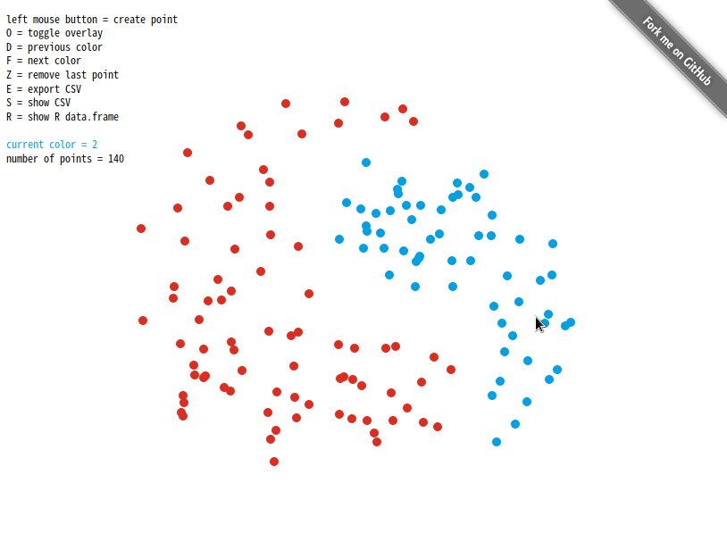

Dati: Draw a dataset yourself!
==============================

Dati allows you to manually draw a dataset on a canvas with multiple groups.
You can export the dataset in CSV or an R obejct.

I created this for testing clustering algorithms.

How to use
----------

Just clone this repo locally and statically serve the root folder (which should redirect
you to `index.html`).

For example, if you have Python 2.x:

    $ python -m SimpleHTTPServer 8000
    
If you have Python 3.x:

    $ python -m http.server 8000
    
If you have NodeJS and [http-server](https://github.com/indexzero/http-server):

    $ http-server

Finally if you are Haskell master race and have [wai-app-static](https://hackage.haskell.org/package/wai-app-static):

    $ warp
